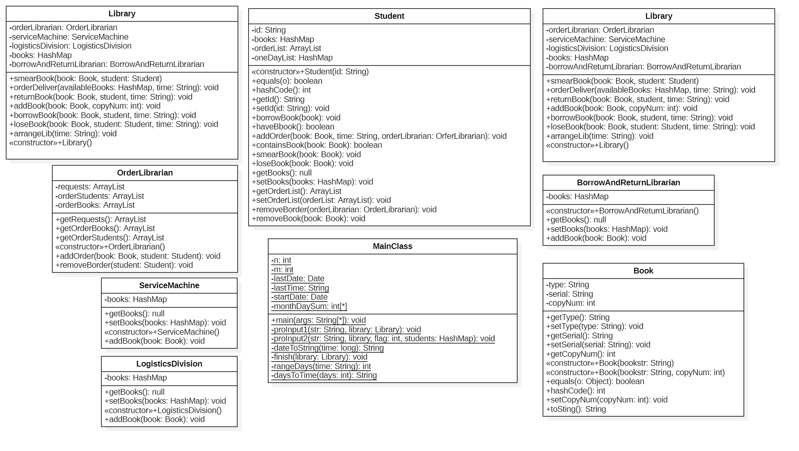
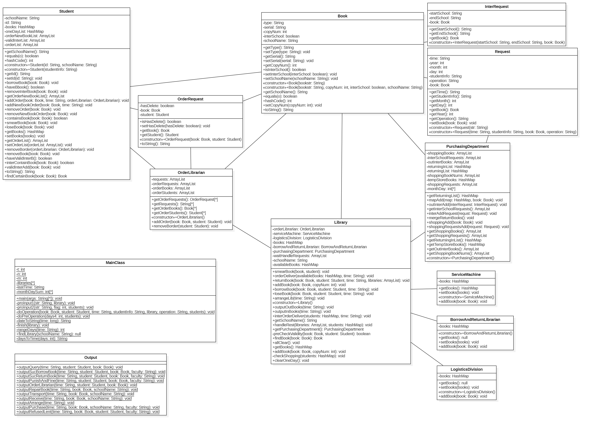
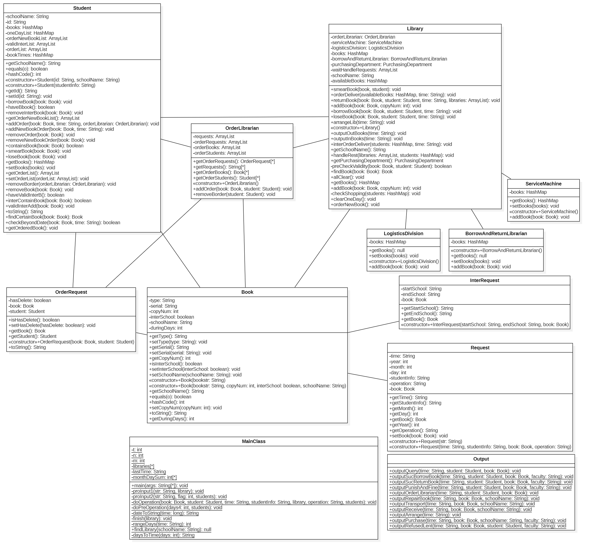

# 面向对象第四单元总结即课程总结

## 1、本单元的正向建模与开发

本单元的主要工作是实现一个图书馆管理系统，图书馆功能复杂，部门繁多，需要先厘清图书馆具有的各个功能，每个部门负责的部分和需要包括的各种功能。

在正向建模与开发的过程中，主要根据需要实现的功能梳理需要的逻辑流程和结构，根据逻辑流程建立不通的主体即类，之后建立起不同主体之间的关系，即各个类之间的关联关系，结合以上内容画出大致的UML图。

在实现具体的功能时，根据大致的框架能够较快地履清大致的思路，并在实现过程中可以继续补充建模过程中抽象掉的细节。

在代码功能实现后进行针对性测试，可以围绕类的结构和功能，需求的处理流程展开，这样能够较容易地测试出Bug所在的位置。

## 2、本单元作业的架构设计
总体而言，由于架构相对而言比较“面向对象”，本单元三次作业我几乎没有重构。在第13次到第14次作业的过程中，由于跨度相对较大，我新增了很多内容，并在局部进行了重构。

### HW13的UML图：
本次作业只涉及到本校的借阅，以图书馆为中心，将每个管理员以及其涉及的功能作为一个类与图书馆类相关联（整理管理员没有相关方法，所以不需新建相关类），使用功能的时候就进行方法调用，这样设计的目的是增加可扩展性，如果后续开发需要添加功能，直接找到对应的实现类就可以及时添加。

### HW14的UML图：
本次作业相比于第13次作业增加了校际借阅流程，需要考虑校际借阅的指令存储以及需要校际运输的书的记录，主要添加`Output`静态输出类，`PurchasingDepartment`图书管理处类，`Request`,`InterRequest`,`OrderRequest`等请求类和一系列校际借书相关的方法。

### HW15的UML图：
本次作业需要实现逾期罚款的功能，改动更小，只需要在现有的类中添加一个借阅时间，然后在还书时进行判断即可，这次作业是oo四个单元中码量与用时最少的。UML图可以在这种改动中快速帮助我们锁定相应位置，便于我们对方法和变量的修改。

### 最终的代码设计和UML模型设计之间的追踪关系

主要是结合图评测中的测试点和自己查找评估追踪关系。

在类图中主要注意`Association`的关系。
    
在时序图中的每个`message`都能对应到代码中的方法，方法在类内部的实现，信息发送的位置也和代码的具体实现相对应，可以串成一条线。

在状态图中的对于借书和还书操作的状态转移，也和代码中的时序一一联系，每一步都能有足够的依据进行转移。

## 3、四个单元中架构设计思维的演进

### 第一单元 表达式化简

第一单元对我来说可以说是面向对象思维的“再见”，上学期的OO pre课程中面向对象是一种相对具象的思维方式，而第一单元的表达式是一种更为抽象的“面向对象”过程。虽然我曾经熟悉过一些java语法，但是在更抽象层面上的思考仍然很欠缺，对整体架构的设计也不太入门。
整体而言第一单元的第一个难点在对递归下降法分析词法的理解，这里的难度是思维上的跨越而非框架上的复杂。
第二个难点就在于架构的设计，虽然课上实验对架构有所提示，但是在表达式化简和第三次作业中的求导我还是不够“面向对象”，在化简过程中我采取的是非常简单的`replaceAll()`方法，这种方法导致了很多Bug。
但是幸好这三次作业在第一次作业的架构上没有进行很多重构，让我的工作量少了不少。

### 第二单元 多线程电梯

第二单元的设计很好的体现了架构的重要性，在研讨课上，同学们交流各种各样的架构方式，实现多线程电梯的控制，分为无调度器，集中式调度器与分布式调度器。我在综合权衡后主要采取了学长的策略，也就是无调度器自由竞争式电梯策略，采用多线程中的“生产者-消费者”模式。

### 第三单元 JML规格

在第三单元 `JML` 规格中，我更注重一种“契约式”编程的模式，这种模式的设计完全由契约的制定方给出，我们完全只需要满足契约的要求即可，即“外包”思想。而这种设计方案的难点更多地体现在算法设计上尤其本单元中涉及的无向图相关算法，而非架构设计。

### 第四单元 基于UML的图书管理

第四单元是我认为架构设计对程序实现最重要的一个单元。在这单元中，我注意了类的高内聚低耦合性，把所有的功能和各种类都细分开，防止出现一手全揽的局面。为了做到这点，我牺牲了一些性能,但也保证了正确性，对每个借书还书的动作都进行了模拟(也为输出带来了方便)。这种架构的设计也为迭代更新带来便利，避免了很多重构带来的不必要风险和麻烦。

## 4、四个单元中测试思维的演进

第一单元我主要使用了讨论区和同学的评测机对数据进行黑盒测试，并且自己构造特殊数据进行测试。

第二单元电梯的测试，手造数据不太方便，主要是白嫖队友和讨论区大佬的评测机来用。

第三单元三次作业是我自己魔改了github上往届学长的评测机进行和同学的对拍，读大佬的评测机代码构造数据也让我获益匪浅。在第三次作业中也是用讨论区同学的评测机进行了测试。对OKTest采用手动构造数据针对每一条进行单独测试。

第四单元主要是在理解题意的基础上手动构造数据进行测试，同时也使用了同学的测试数据查找Bug。

## 5、课程收获

OO课程的工作量弹性很大，如果想要尽善尽美，就需要花费大量的时间与精力，甚至每一周主要的工作都是代码debug与测试。这种高强度训练与设计理念的指导，是有益于思维与能力的提升的。我们学习的不是`Java`这门编程语言，而是通用的面向对象的思想。我感觉以后不论是用何种语言进行代码，都只是换用一种工具去实现自己的面向对象的设计。同时在这个过程中我也学会了很多诸如递归下降，多线程并发，`JML`语言，`UML`建模等方面的知识，让自己的技术栈更加全面。在互测中也训练了测试和寻找别人`bug`的能力。