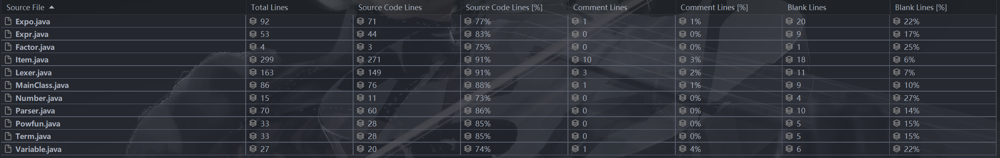
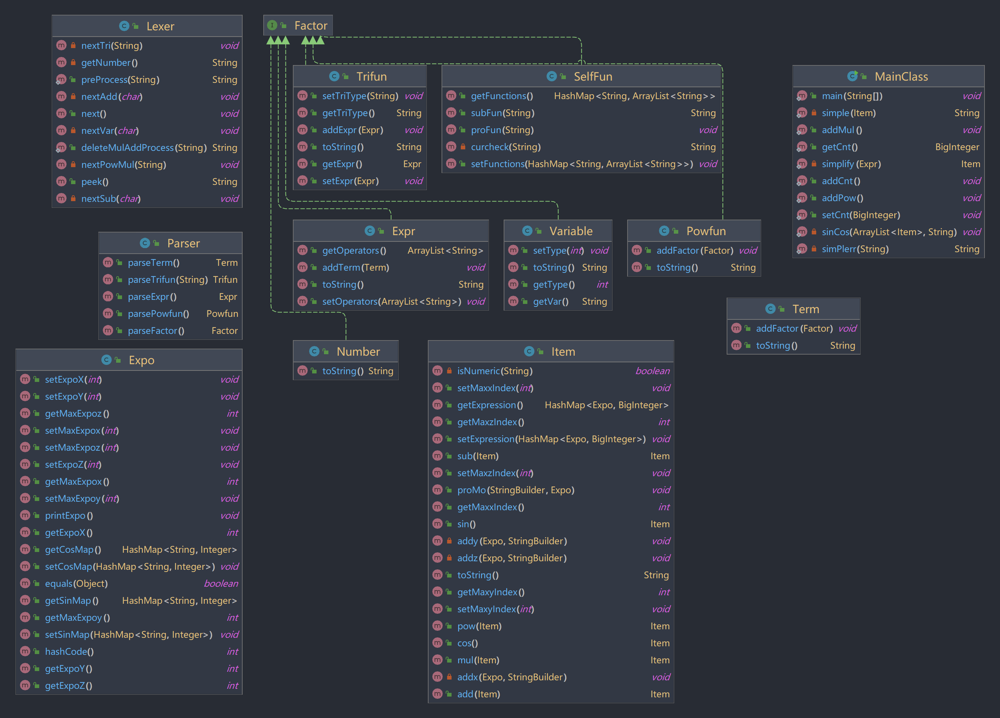
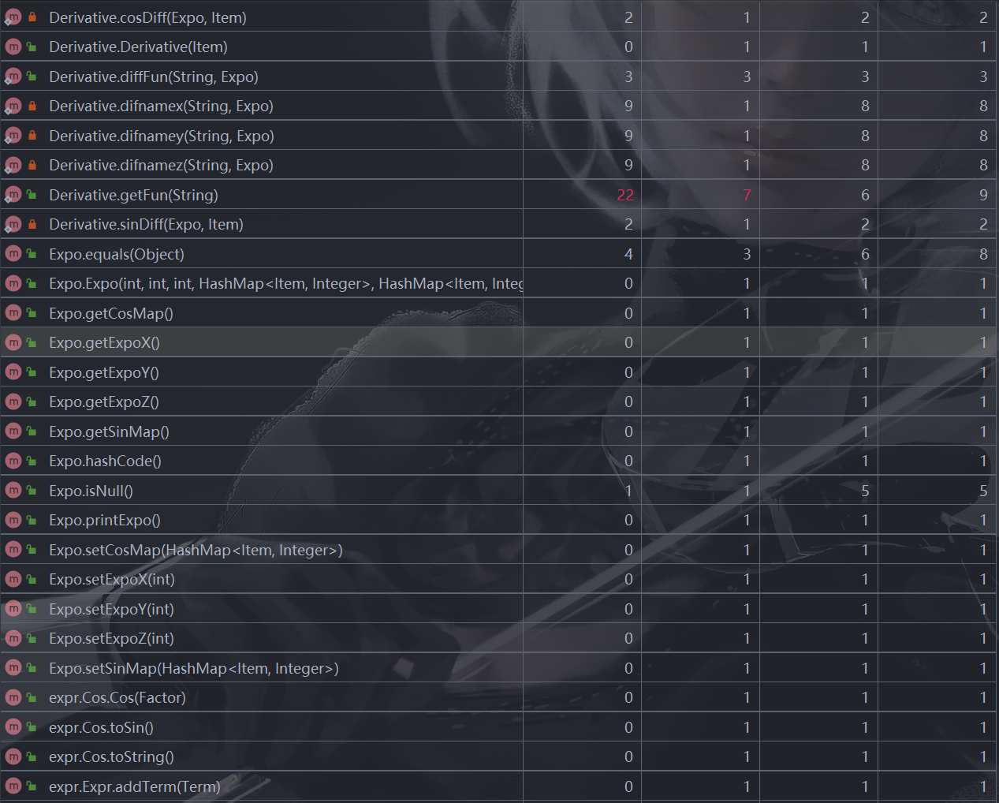
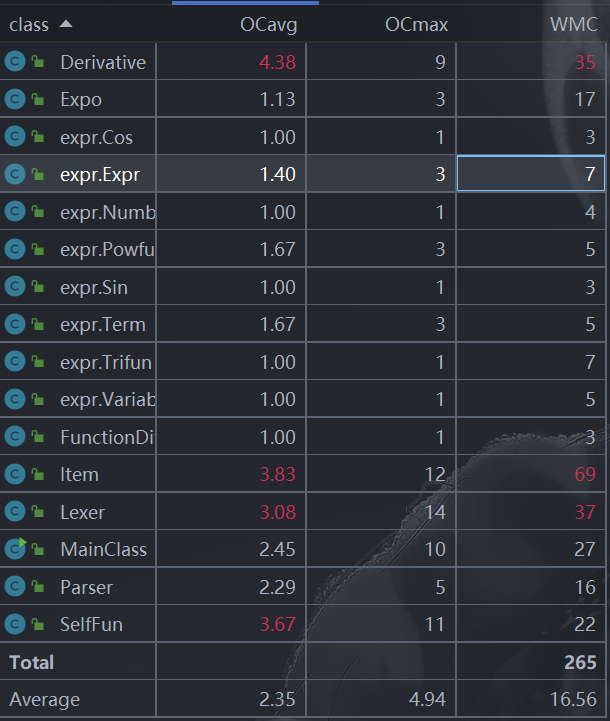

# 第一单元总结
## 一、三次作业总结
### 第一次作业
+ 总结：第一次作业为对包含幂函数和常数的三元多项式进行括号化简，且总共只有一层括号嵌套。
+ 思路分析： 我的思路大体来讲分为两部分：
    1. 将所给表达式用递归下降法化为后缀表达式。
    2. 用栈计算后缀表达式，设计了多项式类`Item`和单项式类`Expo`，分别存储计算得到的多项式和单项式，单项式的

以下是第一次作业的UML类图：


下面分别介绍每个类的设计作用：
+ **Lexer类**：递归下降法中的**词法分析器**
  1. 其中设计了`preProcess`和`deleteMulAddProcess`两个预处理方法
     1. 将所给表达式中连续的+/-化为一个等价的+/-号
     2. 将\*\*后面的+删除
     3. 第一项为符号的话在开头补0。注意在最开始用replaceAll将表达式中的空格和\t都去掉。
  2. 保证每次都能读到一个操作数或操作符。
+ **Parser类**：递归下降法中的**语法分析器**，分别对Expr(表达式)，Term(项)，Powfun(幂函数项)，Factor(因子)处理。识别到`(`进行递归调用处理Expr
+ **Expo类**：单项式类，将每一个单项式存储为$x^a*y^b*z^c$的形式。
+ **Item类**：多项式类，用Hashmap存储多项式中含有的单项式，即$hashmap<Expo, Big Integer>$,其中Big Integer是单项式Expo的系数。同时重写toString()方法，使最终能够呈现正确的结果。
+ **因子类接口Factor**:
   - **表达式（加减）类Expr**: 
      - 储存表达式
      - 用ArrayList存储加减号
      - 重写toString方法输出在该类中的数及`+/-`号
   - **项（乘除）类Term**:
      - 储存项
      - 重写toString方法输出该类中存储的数以及`*`号
   - **基本项（幂）类Powfun**:
      - 储存基本项
      - 重写toString方法输出该类中存储的数以及`**`号 
   - **常量类Number**: 
      - 储存常量因子
   - **变量类Variable**: 
      - 储存变量因子
  
#### 基于度量的程序结构分析
+ 代码规模分析：
  
+ 方法复杂度分析：
  
  
  - 分析方法复杂度可以看到Item类中的重写toString()方法由于自身调用了两次`for`循环及较多的`if-else`语句导致本身方法的复杂度过高。
  - 在Lexer.next()方法中需要对每次解析出的字符进行特判，使用了大量的`if-else`,复杂度高在所难免。
  - Lexer.preProcess()方法中是对连续的`+/-`号进行化简，采用了`for`循环中套`if-else`的写法，也导致了方法的复杂度高。
+ 类复杂度分析：
  
  - 三个核心大类由于代码量较多，调用较为复杂导致了整体略显臃肿，复杂度也爆红过高。

### 第二次作业
+ 总结：第二次作业相比于第一次作业增加了三角函数，自定义函数和括号嵌套层数的要求，由于我在第一次作业中采用的用递归下降方法化为后缀表达式的做法可以解析任意层数的括号。括号嵌套的问题相当于自然解决。下面来说明对于三角函数和自定义函数的解决方法：
  - **三角函数**：三角函数只包含`sin`和`cos`,在化后缀表达式过程中我们可将`sin`和`cos`视为<u>**单目运算符**</u>，在化简过程中视为`Expr类`之上的一种<u>**因子**</u>，这样就可以解决三角函数的问题。
  - **自定义函数**: 自定义函数只包含f,g,h三种形式，且定义时不可调用其他函数，所以我采用了<u>**正则表达式匹配**</u>的方法获取自定义函数的表达式和形参，<u>**在带入实参时注意需要先将xyz自变量换为等价的不重复变量**</u>，避免嵌套调用时出现问题。并且对于嵌套调用问题注意需要<u>**递归**</u>解决方法。
  
以下是第二次作业的UML类图:

相比于第一次作业，在Factor因子下新增`Trifun`(三角函数类)，`SelfFun`(自定义函数类),在`Expo`类中加入$hashmap<String, Integer>$分别记录三角函数的内容和指数，重写`Item`类中的计算方法。

+ **Trifun类**：三角函数类：
  - 该类在递归下降算法中位于Expr类之上，具有addExpr方法用于递归。
  - 用字符串triType记录三角函数类型
  - 重写toString()方法，将该类存储的表达式和三角函数符号输出，即输出为$sin/cos(Expr)$类型

+ **SelfFun类**：自定义函数类：
  - 该类采用$hashmap<String, ArrayList<String>>$的方法存储自定义函数，比如`f(x) = x**2`,存储为`Hashmap<f,[x, x**2]>`
  - proFun方法负责预处理自定义函数的定义，获取自定义函数的表达式及形参，并存储到Hashmap中
  - subFun方法用栈数括号的思想将自定义函数带入表达式中
  - curcheck方法用于解决自定义函数调用过程中的递归调用问题

+ **Item类**：多项式类进行修改：
  - 新增`sin/cos`计算方法，并对其他方法进行重构以降低时间复杂度
  - 存储方法仍为$Hashmap<Expo, Big Integer>$

+ **Expo类**：单项式类进行修改：
  - 新增`hashmap<String, Integer> sinMap`和`hashmap<String, Integer> cosMap`存储含有的三角函数
  - 重写hashcode和equals方法使在Item类中便于合并同类项

+ **Lexer类和Parser类**：修改：
  - 增加sin和cos识别
  - 递归下降输出后缀表达式时加入三角函数类，新增Parser.parseTriFun方法

#### 基于度量的程序结构分析
+ 代码规模分析：
  
+ 方法复杂度分析：
  
  
  - 与第一次作业问题大致相同，一是因为for循环调用嵌套较多，二是因为`if-else`过多导致爆红
+ 类复杂度分析：
  
  - 与第一次相比，MainClass类复杂度降低，新增的SelfFun类复杂度较高。

### 第三次作业
+ 总结：第三次作业相比于第二次作业增加了求导因子，自定义函数定义调用的要求，处理这两个问题我的思路：
  - 求导因子：类似于三角函数视为单目运算符，在`Item`类中添加求导方法，对于我的存储形式而言，求导的一个重要公式是：
  $$
  \begin{array}{l}y=f_1(x)\cdot f_2(x)\dots   f_n(x)\\ 
  y'=f_1'(x)\cdot f_2(x)\dots,f_n(x)+f_1(x)  \cdot f_1'(x)\dots,f_{n}(x)+f_{1}(x)\cdot   f_{2}(x)\dots f_{n}'(x)\\ 
  y'=\sum_{j=1}^{n}f_j'(x)\prod\limits_{i}^  {n}f_i(x)\left(i\neq j\right)\end{array}
  $$
  利用该公式，可以将单项式导数求出，之后相加即可
  - 自定义函数定义调用：先对自定义函数中的表达式进行化简的整个流程，之后带入输入即可

以下为第三次作业的UML类图：

~~（Cos类和Sin类其实没有用到）~~
相较于第二次作业的修改：
新增求导方法类`Derivative`,`Item`类中新增求导方法Item.diff,重写hashcode和equals方法，`Lexer`和`Parser`类中类似于三角函数类增加解析求导因子(`dx/dy/dz`)的部分和`parseDiff`方法，`Expo`中存储三角函数的Hashmap改为$Hashmap<Item, Integer>$，`SelfFun`类中proFun方法新增定义处理。
+ **Derivative类**：求导方法类：
  - `diffFun`方法，对单项式进行求导，返回一个多项式，遍历单项式中的每一个部分：幂函数部分，三角哈希部分，依次按公式求导，**注意三角内部Item求导递归调用`Item`类中的diff方法**
  - `sinDiff/cosDiff`方法，对三角函数的求导方法，在`diffFun`中被调用
  - `diffnamex/diffnamey/diffnamez`方法，分别对应三个不同的求导因子进行求导方法
  
#### 基于度量的程序结构分析
+ 代码规模分析：
  
+ 方法复杂度分析：
  
  
  
  - 与第二次作业问题大致相同，一是因为for循环调用嵌套较多，二是因为`if-else`过多导致爆红
+ 类复杂度分析：
  

## 二、分析自己程序的Bug
这三次作业的强测和互测笔者本人做得不是很好，在三次强测中都出现了Bug,在互测中也被同学刀中了Bug。但是根据本人分析，这些Bug可以说跟架构的关系不大，反倒都是些细节的问题处理时欠考虑导致了错误。
### 第一次作业的Bug
+ 优化过程中采用的replaceAll方法将所有的`1*`和`*1`都化没了，导致`x**10`这种变成了`x0`发生错误。**化简要从架构层面进行，而最好不用replaceAll()等无脑化简法。**
+ 互测中的数据发现Item.mul方法中的循环次数过高导致TLE，于是重构了该方法来降低时间复杂度。
### 第二次作业的Bug
+ 强测中的两个点和互测中的一个点是由于在将函数实参传进形参的时候笔者没有加括号。正确写法如下：
  ``` java
  finalcon = finalcon.replaceAll  (formpara[i],"(" + vars[i] + ")");
  ```
  这导致了笔者后续转化为后缀表达式时运算顺序发生了错误,比如`--1**2` 和 `-(-1)**2` 的结果是不同的。
+ 在优化中笔者再次出现了问题，这导致了互测中7个RE数据，始作俑者就是优化函数中的
  ``` java
  newstr.charAt(0) == '1' && newstr.  charAt(1) == '*'
  ```
  由于笔者没有判断输出newstr的长度，如果newstr只有一个字符，那么这句代码就会让程序RE,因为没有charAt(1),为了修正这个Bug，笔者在代码中增加了条件判断，变成了如下形式：
  ``` java
  if (newstr.length() == 1) {
              sb.append(newstr.charAt (0));
          }
  if (newstr.length() >= 2 && ! (newstcharAt(0) == '1' && newstr.  charAt(1) ='*')) {
      sb.append(newstr.charAt(0)).appe  (newstr.charAt(1));
  }
  ```
+ 在经历了第一次作业互测中的TLE问题后，笔者本次作业又出现了TLE问题，原因在于Item类的mul方法中for循环的次数过多。经过分析，笔者发现了该方法中初始化的thisItem设为了`Item("0")`,导致循环时expression中的Item过多而循环次数也随之急剧增多，于是将thisItem初始化为`Item("")`，并在mul方法的for循环中加入条件判断，避免过多次引用add方法来降低时间复杂度。
  
### 第三次作业的Bug
+ 本次作业只有一个Bug:
  在求导时，由于单项式求导变为多项式，笔者需要将得到的多项式系数乘以原单项式系数，并把他们相加，这时出现了一个非常简单的bug。 原代码：

  ``` java
  //Item tempItem = new Item("");
  thisItem.getExpression().put(expo1, newItem.  getExpression().get(expo1).
      multiply(this.expression.get(expo)));
  //thisItem.add(tempItem);
  ```

  原来处理时其实考虑到了这一点，但当时由于求导结果都为0，没有细想，以为是加法的错误，实际上只是因为`thisItem.add(tempItem);`没有赋给最新的`thisItem`,在意识到这点后，只需要将代码改为：

  ``` java
  Item tempItem = new Item("");
  tempItem.getExpression().put(expo1, newItem.  getExpression().get(expo1).
      multiply(this.expression.get(expo)));
  thisItem = thisItem.add(tempItem);
  ```
  即可。

## 三、分析自己发现别人程序bug所采用的策略
+ 构造特殊数据比如sin(0),(x-x)**0,cos(0)等
+ 构造幂指数较大的数据（为了卡TLE）,比如`(x**8+y**8+z**8)**8`等
+ 采用python自动评测机，效果：不太好，我在第三次作业中采用了评论区大佬的自动评测机跑了上万组数据，但是由于生成数据的随机性，强测中的错误并没有被测出来，更多的时候还是需要自己手动构造效果较好。

## 四、心得体会
通过本单元艰难的学习，我对面向对象思想和递归下降算法有了新的认识。

不同于上学期的OO pre课程，本学期的OO课程感觉难度骤增，虽然我曾经熟悉过一些java语法，但是在更抽象层面上的思考仍然很欠缺。在思考做法的时候也很艰难，我本人觉得最难的一次作业其实是第一次，对于一个好架构的设计的犹豫，对于递归下降的理解，让我在第一次作业中经历了一个很痛苦的过程。幸好这三次作业在第一次作业的架构上没有进行很多重构，让我的工作量少了不少。

在程序所出现的Bug中我的进步空间还有很大，一个是要**细心**，避免低级Bug的出现，比如第三次作业，一个是要尽可能**思考全面**，比如第一次作业和第二次作业，此外就是**多做测试，分类构造**，不要迷信评测机，有时手动构造比评测机的效果好的多。

