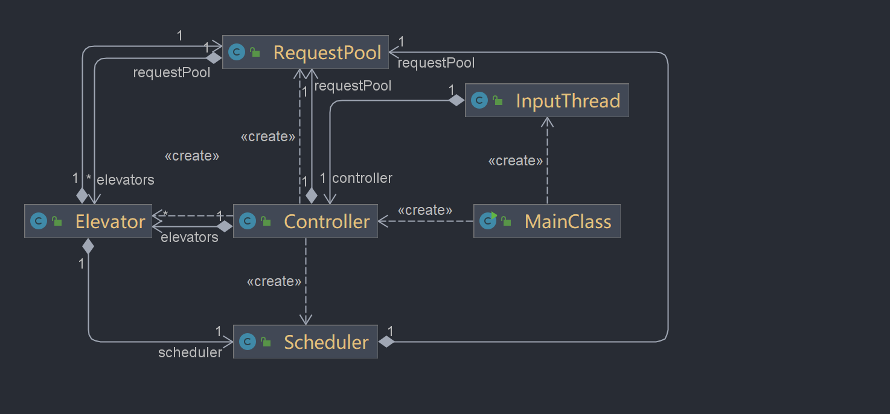
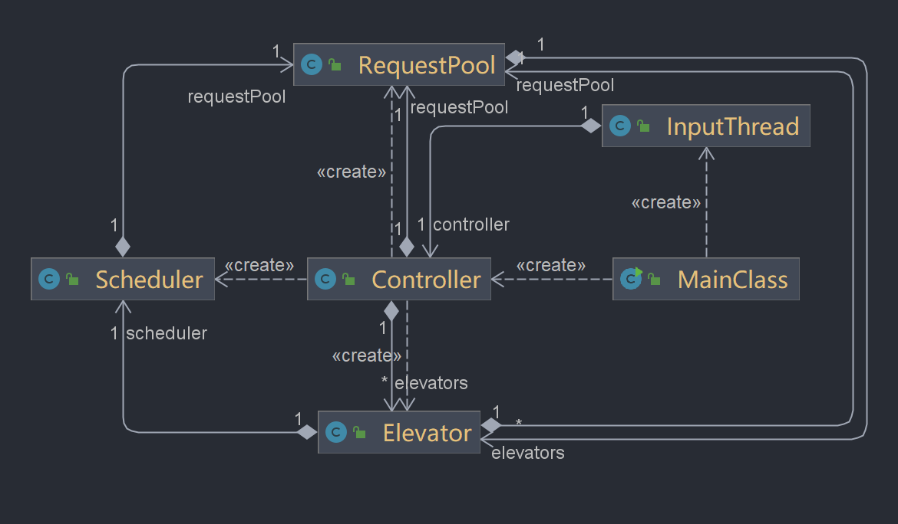
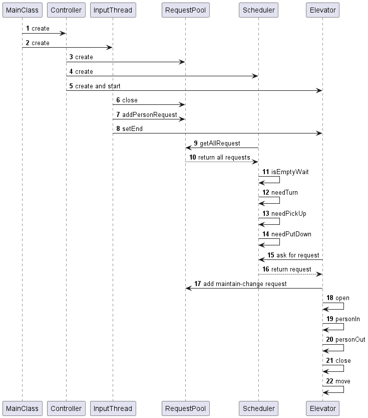
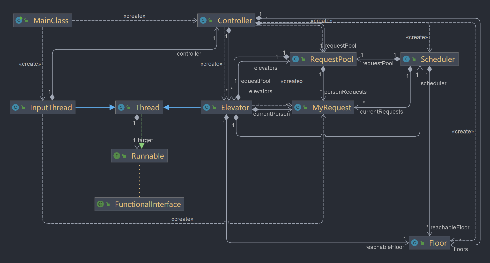
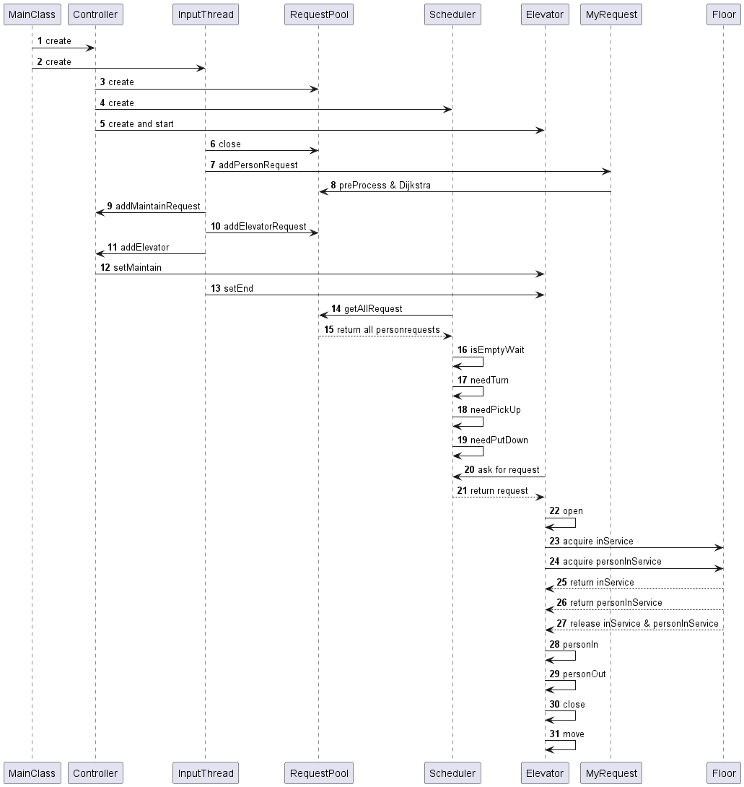

# 面向对象第二单元总结
## 第一次作业总结
### 要求：
实现一个多线程实时电梯系统，六台电梯可以在1-11楼之间运行，从标准输入读入请求信息，将乘客送到目的地并输出`ARRIVE、IN、OUT、OPEN、CLOSE`等必要信息。

### UML类图：


### UML时序图：


### 基本思路：
+ 控制器：在程序开始时实例化所有电梯并启动线程，实例化请求池，在输入结束时通知所有线程结束。
+ 输入：乘客请求经过 `InputThread` 类进入公共请求池，由于请求进入请求池的前后顺序无要求，并且请求之间互不影响，因此此过程并不会产生线程安全问题。
+ 单个电梯的运行策略（LOOK算法）：
  - 若电梯无人，此时请求池无请求，等待。
  - 若电梯无人有请求，沿原方向前进。
  - 若电梯有人，判断当前是否需要开门，若不用开门，则沿原方向前进。
+ 请求池：相当于**生产者-消费者**中的**托盘**，该对象被所有电梯线程可能同时访问/修改，故该类中所有**修改请求池（包括请求和电梯序列）**的方法均应加锁，来保证线程安全。
+ 电梯：每部电梯是一个单独线程，各线程之间互不干扰，每个电梯的行动由自己的`Scheduler`调度，在`run`方法中以状态机的方式实现电梯的状态转换。
+ 程序结束：`InputThread`类中判断到输入截止后，输入线程终止，调用控制器的`close()`方法，进而调用请求池的`close()`方法，将所有电梯的`isEnd`置为`true`,之后电梯在将请求池中和已经载入的客人的请求都完成后结束`while(true)`循环，终止电梯线程，结束程序。
+ 多步电梯的调度策略：没有进行调度器设计，三次作业从始至终都是自由竞争的策略。

### LOOK策略的具体实现
在本次作业中，由于我采用了自由竞争的多部电梯调度策略，基于LOOK的单部电梯调度策略就显得尤为重要，我的大致实现框架如下：
``` java
public void ask(Elevator elevator) {
        // TimableOutput.println("Elevator" + this.eleID + " is asking...");
        this.currentRequests = elevator.getCurrentPerson();
        this.currentFloor = elevator.getCurrentFloor();
        this.currentDirection = elevator.getCurrentDirection();

        pickUp.clear();
        putDown.clear();

        // 获取请求池
        allRequests = requestPool.getAllRequest();

        // 判断电梯是否进入或退出空等
        isEmptyWait(); 

        // 判断电梯是否转向并转向
        needTurn();

        // 判断电梯是否应该载入人更新载人序列
        needPickUp();

        // 判断是否应该从电梯下人更新下人序列
        needPutDown();
    }
```

关于`needPickUp()`函数，分两步来实现，即：
``` java
private void needPickUp() {
        // 接第一个人和与其相同目的地的
        firstNeedPickUp();

        // 接剩下的人
        restNeedPickUp();
    }
```


## 第二次作业总结
### 要求：
在第一次作业的基础上增加了`ADD`和`MAINTAIN`指令,可以实现新增电梯和维护电梯的需求。

### UML类图


### UML时序图


### 基本思路与迭代修改
在第五次作业的基础上，本次作业的修改与迭代并不困难，我没有重构，整体框架与第五次几乎一致。
+ 对于`ADD`命令,只需要在`InputThread`类中接收到命令后，传递给`Controller`类，实例化新增电梯，并在`RequestPool`和`Controller`的电梯序列中加入新增电梯即可。
+ 对于`MAINTAIN`命令，在`Elevator`类中设置`isMaintain`标志，该标志为`true`代表该电梯线程被`maintain`,在`run()`函数中判断当前电梯中是否还有人，若无人且被维护，则可以结束并输出`MAINTAIN_ABLE`。同时，在`personOut`函数中判断电梯是否被维护，若标志已经为`true`代表该电梯中所有人需要即刻被放下，并将新请求加入`RequestPool`中。
  
**注意：** 在本次作业中针对Maintain电梯的考虑，`InputThread`中的结束条件不再为`request == null`，还需维护一个记录maintain电梯数的常量`cnt`,当`cnt == 0`时，才可结束`Controller`,此举是为了避免最后指令是`Maintain`时，此电梯放下乘客后其他电梯线程都结束而导致该乘客没有抵达目的地的情况发生。

## 第三次作业总结
### 要求：
新增电梯可达性的限制，以及大楼每一层对于“服务中”和“只接人”电梯的数量限制。

### UML类图


### UML时序图


### 基本思路与迭代修改
本次作业可以说是让我比较痛苦了，针对本次作业我新增了两个类，对Elevator中的一些行为进行了增添，代码量从原来的四百多行激增到近一千行。反思原因，还是大一时的数据结构学的不够扎实 ~~(Dijkstra早就忘了，逃)~~。
+ 电梯可达性的记录：只需要在每个电梯中增加一个数组存储电梯可到达的楼层即可。
+ “服务中”和“只接人”电梯的数量限制：增加了`Floor`类，实例化了11个楼层，每个楼层中存储**4个**`inService`信号量和**2个**`personInService`信号量，用于分别记录服务中和只接人的电梯数量。添加两种信号量的`acquire`和`release`方法。
+ 电梯不能直达的乘客换乘策略：重新封装官方包中的`PersonRequest`类为`MyRequest`类，增加`preProcess`和`Dijkstra`方法，对于每一个新请求，先进行`preProcess`。
  - 如果电梯序列中有直接到达该请求的出发与目的楼层的，该请求不变。
  - 如果需要换乘，用邻接矩阵方法记录存储图，将图的边权设为1，计算出最短换乘方法。在每个`MyRequest`中用栈记录换乘楼层，每次弹出一个楼层必然能够保证该请求的`fromFloor`和`toFloor`能够直达。
  
  在每次`ADD`新电梯和`MAINTAIN`老电梯时更新全部请求。
+ 电梯线程何时结束：考虑到电梯的可达性和换乘等的限制，本次作业中需要等所有请求结束后电梯线程一起结束。这样才能保证最后所有乘客能够到达目的地。

## BUG修复与本地测评
本单元作业很不幸，虽然我在每次作业中都采用了自动评测机进行测评，但是由于测评数据的种类和压力不够多和不够大，导致了课下以为自己的代码没有问题，但是一进强测就出现问题。
+ 第一次作业BUG：本次作业中强测和互测只有一个BUG，但是让我痛不欲生 (~~死得很惨~~)。在电梯的设计中我混淆了电梯的**等待队列**和**现有队列**。所谓**等待队列**是指，还没有上电梯但是进入电梯的`pickUp`队列的乘客。而**现有队列**指的是现在就在电梯中的乘客，我在限制电梯容量时对等待队列进行了限制，而非现有队列，这就导致了电梯中的人数可能会超过容量。这直接导致了强测20个点错了15个点的惨剧qwq。
+ 第二次作业BUG：本次作业强测和互测还是只有一个BUG，导致了我错误的点全是`CTLE`。一般而言，导致`CTLE`的情况都是**轮询**。我通过讨论区大佬的思路用`JProfiler`软件对我的程序进行了分析。发现在`InputThread`类中，判断什么是结束条件时，我 ~~手欠地~~ 加了一个`if(requestPool.isEmpty())`，而这个函数里是存在`notifyAll()`方法的，由于要等待输入的请求为空和`MAINTAIN`的电梯数量为0，在这个期间，`InputThread`就在疯狂地进行该循环。直接导致轮询占用`CPU`时间过高,是`CTLE`的罪魁祸首。解决方法很简单，直接删去该判断就好了。
+ 第三次作业BUG：本次作业仍然只有一个BUG，但是这次我错的点都是`RTLE`。原因是什么呢？在经过我众多的输出判断后终于发现，在`personInService`信号量被获取后，由于我对释放条件的错误判断，导致如果电梯在获取该信号量开门后被`MAINTAIN`,就无法将该信号量释放。如果某层的两个信号量都这样无法被释放，就会导致其他电梯线程无法来本层接人，进而导致**死锁**，导致了`RTLE`。那么解决方法就是每个电梯线程中再增加一个是否获取到`personInService`信号量的**标志量**，若获取了信号量，就置为`true`,在关门时判断一下这个标志量进行释放即可。

经过本单元的三次作业，我基本上把电梯单元各个易错的问题都犯了一遍，但是遗憾的是都是在强测中才测出来(~~分都没有了~~)。最直接的解决BUG方法还是在**写的时候多思考，尽量一遍正确完成**，不然像我一样虽然测了很多组数据，但是数据的压力和强度不够的话，这些BUG依靠后期是很难发现的。(虽然评测机仍然测出了我代码的很多BUG，如果没有修改估计会死得更惨，感谢评论区大佬们的评测机)

对于本地测评寻找BUG时，我更多采用的还是多加`println`，将能输出的信息都输出，这往往是最容易也是最快的调试方法。

## 心得体会
+ 通过本单元的学习，我初步了解了`Java`多线程编程的思想与调试方法。经过各种试错的经历也对多线程中各种问题有了深入的理解。

+ 在三次作业中，我逐渐掌握了**生产者-消费者模式**的设计构造，了解了**线程安全**的设计，对**共享对象**的控制，对**轮询死锁**等常见易错点的亲自实验与修复。这些知识与实践经历都让我获益匪浅。


